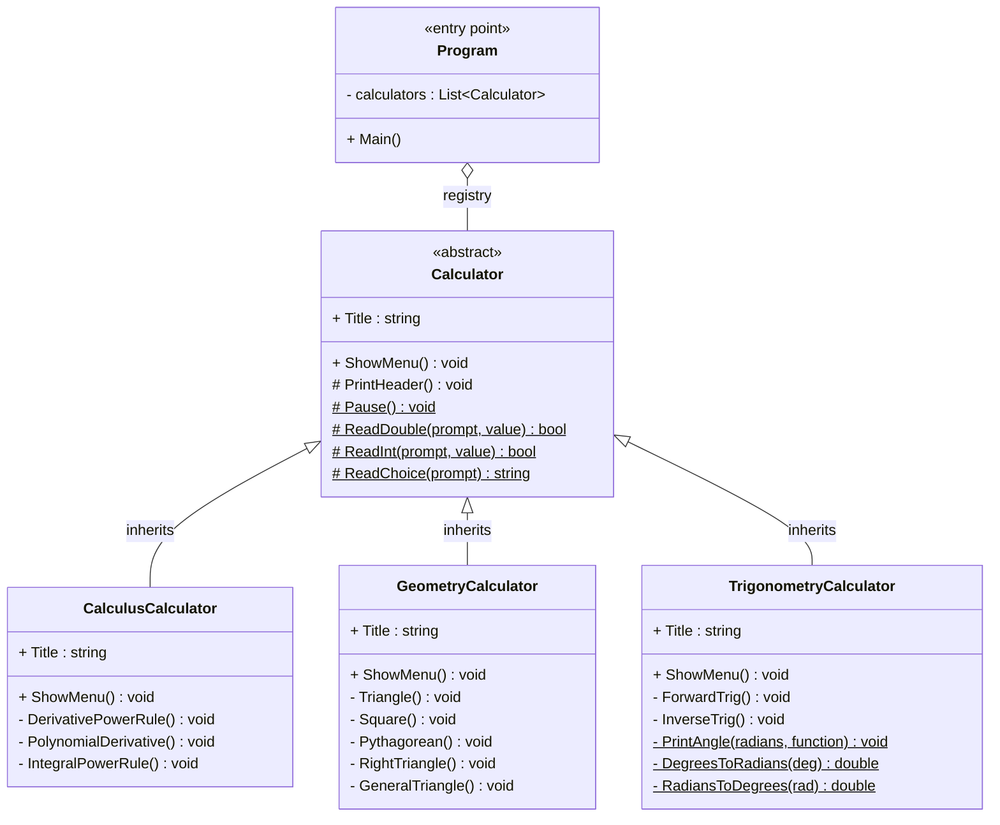
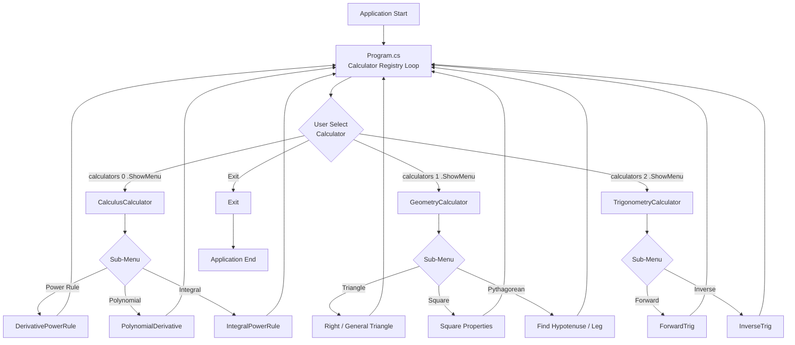
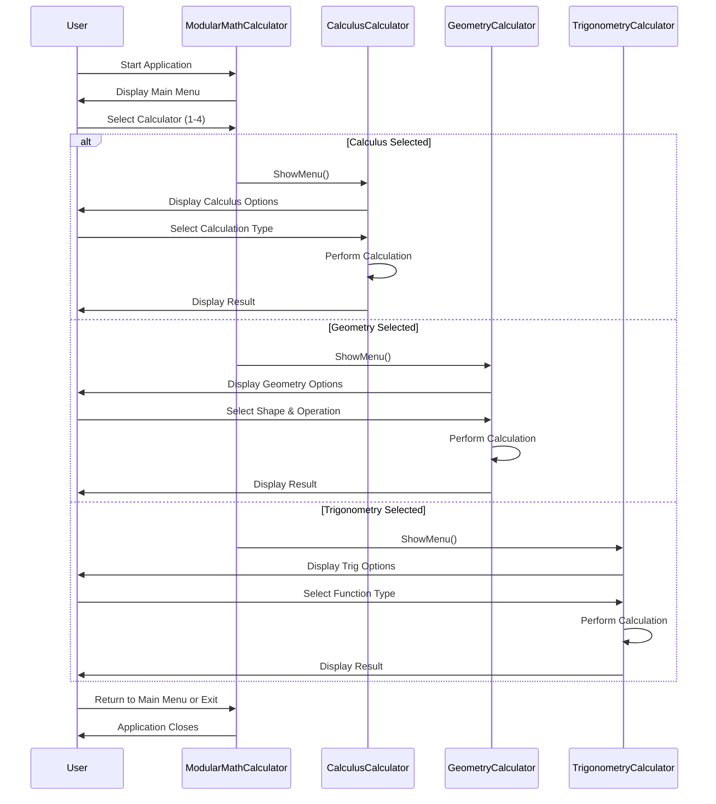
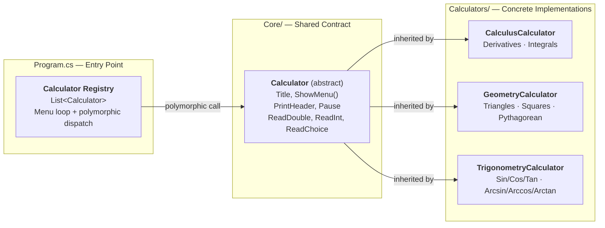
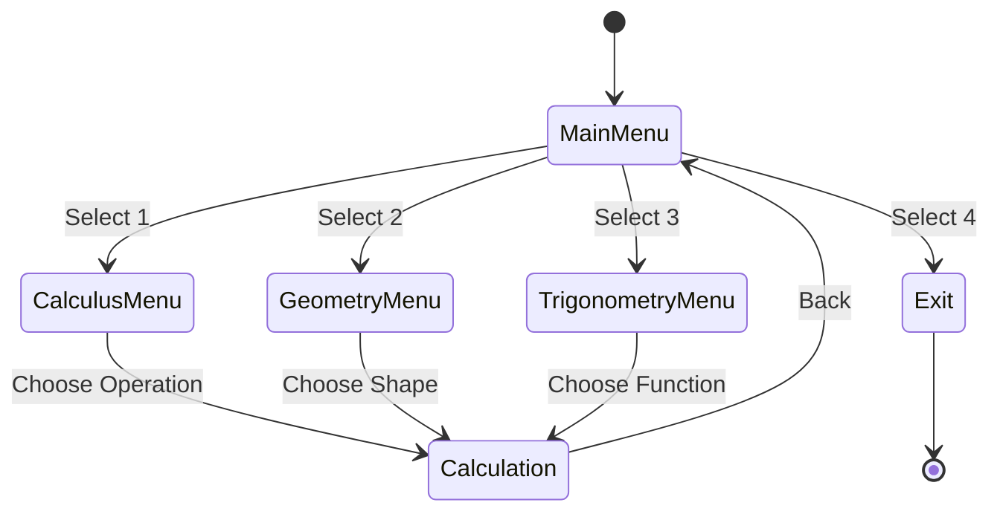
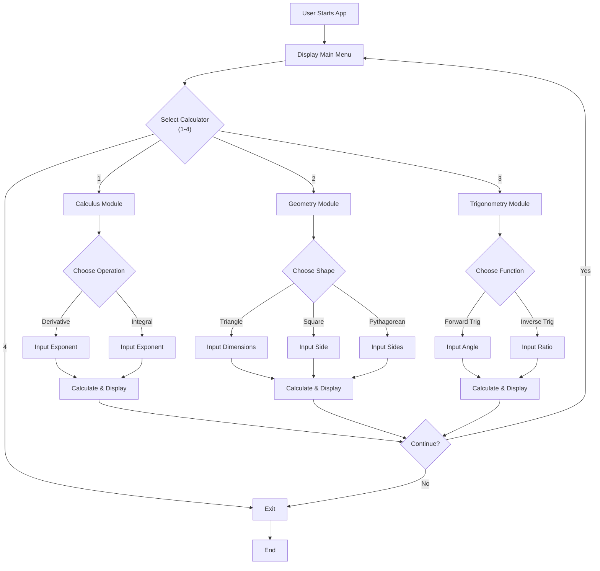
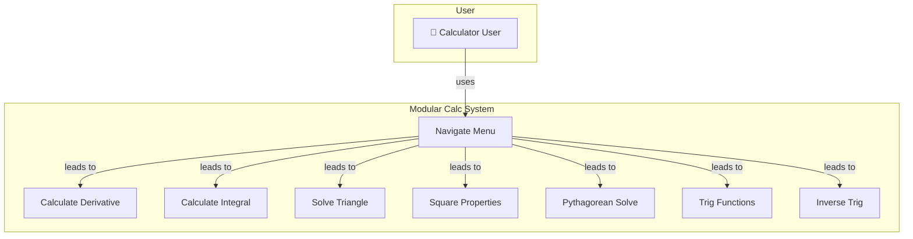
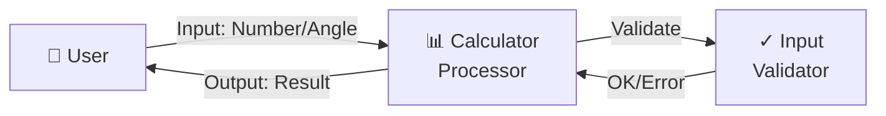
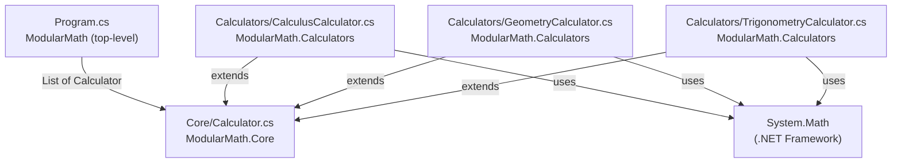

# Modular Math Calculator - UML

## Project Overview

A console-based modular mathematics calculator system with three main calculator modules:

1. **Calculus Calculator** - Derivatives & Integrals
2. **Geometry Calculator** - Triangles, Squares, & Pythagorean Theorem
3. **Trigonometry Calculator** - Sin, Cos, Tan & Inverse Functions

---

## Class Diagram



---

## System Architecture Diagram



---

## Sequence Diagram - User Interaction Flow



---

## Component Diagram



---

## Calculus Calculator - Method Details

| Method                   | Purpose                    | Input                    | Output                            |
| ------------------------ | -------------------------- | ------------------------ | --------------------------------- |
| `ShowMenu()`             | Displays calculus sub-menu | User choice              | Routes to appropriate calculation |
| `DerivativePowerRule()`  | Calculates d/dx(x^n)       | Exponent n               | Derivative formula                |
| `PolynomialDerivative()` | Handles multiple terms     | Coefficients & exponents | Sum of derivatives                |
| `IntegralPowerRule()`    | Calculates ∫x^n dx         | Exponent n               | Integral formula with constant    |

### Supported Operations

| Operation             | Formula                               | Example   | Result   |
| --------------------- | ------------------------------------- | --------- | -------- |
| Power Rule Derivative | d/dx(x^n) = n·x^(n-1)                 | d/dx(x³)  | 3x²      |
| Polynomial Derivative | Σ(coefficient × exponent × x^(exp-1)) | d/dx(3x²) | 6x       |
| Power Rule Integral   | ∫x^n dx = x^(n+1)/(n+1) + C           | ∫x² dx    | x³/3 + C |

---

## Geometry Calculator - Method Details

| Method                 | Purpose                        | Inputs               | Outputs                    |
| ---------------------- | ------------------------------ | -------------------- | -------------------------- |
| `ShowMenu()`           | Displays geometry sub-menu     | User choice          | Routes to shape calculator |
| `TriangleCalculator()` | Calculates triangle properties | Side lengths or legs | Area, perimeter, angles    |
| `SquareCalculator()`   | Calculates square properties   | Side length          | Area, perimeter, diagonal  |
| `PythagoreanTheorem()` | Applies a² + b² = c²           | Two of three sides   | Missing side               |

### Triangle Calculations

#### Right Triangle (when 2 legs known)

| Property   | Formula                  | Validation                 |
| ---------- | ------------------------ | -------------------------- |
| Area       | (leg₁ × leg₂) / 2        | Both legs must be positive |
| Hypotenuse | √(leg₁² + leg₂²)         | Computed from legs         |
| Perimeter  | leg₁ + leg₂ + hypotenuse | Sum of all sides           |

#### General Triangle (when 3 sides known)

| Property           | Formula             | Validation                       |
| ------------------ | ------------------- | -------------------------------- |
| Semi-perimeter (s) | (a + b + c) / 2     | Must satisfy triangle inequality |
| Area (Heron's)     | √[s(s-a)(s-b)(s-c)] | Each factor must be positive     |
| Perimeter          | a + b + c           | Sum of all sides                 |

### Square & Pythagorean Operations

| Shape          | Property         | Formula        |
| -------------- | ---------------- | -------------- |
| Square         | Area             | a²             |
| Square         | Perimeter        | 4a             |
| Square         | Diagonal         | a√2            |
| Right Triangle | Find Hypotenuse  | c = √(a² + b²) |
| Right Triangle | Find Missing Leg | b = √(c² - a²) |

---

## Trigonometry Calculator - Method Details

| Method                     | Purpose                        | Input         | Output                  |
| -------------------------- | ------------------------------ | ------------- | ----------------------- |
| `ShowMenu()`               | Displays trigonometry sub-menu | User choice   | Routes to trig function |
| `CalculateTrigFunctions()` | Computes sin, cos, tan         | Angle (°/rad) | All three ratios        |
| `CalculateInverseTrig()`   | Finds angle from ratio         | Ratio value   | Angle in ° and radians  |

### Forward Trigonometric Functions

| Function | Definition            | Domain                    | Range    |
| -------- | --------------------- | ------------------------- | -------- |
| sin(θ)   | opposite / hypotenuse | All real numbers          | [-1, 1]  |
| cos(θ)   | adjacent / hypotenuse | All real numbers          | [-1, 1]  |
| tan(θ)   | opposite / adjacent   | All real except ±π/2 + nπ | All real |

### Inverse Trigonometric Functions

| Function  | Input Range | Output Range | Use Case                |
| --------- | ----------- | ------------ | ----------------------- |
| arcsin(x) | [-1, 1]     | [-π/2, π/2]  | Find angle from sine    |
| arccos(x) | [-1, 1]     | [0, π]       | Find angle from cosine  |
| arctan(x) | All real    | (-π/2, π/2)  | Find angle from tangent |

### Unit Conversion

- **Degrees to Radians**: radians = degrees × (π/180)
- **Radians to Degrees**: degrees = radians × (180/π)

---

## State Diagram - Main Menu States



---

## Activity Diagram - Calculation Flow



---

## Mathematical References

### Calculus Formulas

**Power Rule for Derivatives**
$$\frac{d}{dx}(x^n) = n \cdot x^{n-1}$$

**Power Rule for Integrals**
$$\int x^n \, dx = \frac{x^{n+1}}{n+1} + C$$

### Geometry Formulas

**Heron's Formula (Triangle Area)**
$$A = \sqrt{s(s-a)(s-b)(s-c)} \quad \text{where} \quad s = \frac{a+b+c}{2}$$

**Pythagorean Theorem**
$$a^2 + b^2 = c^2$$

**Square Diagonal**
$$d = a\sqrt{2}$$

### Trigonometry Formulas

**Basic Ratios**
$$\sin(\theta) = \frac{\text{opposite}}{\text{hypotenuse}}, \quad \cos(\theta) = \frac{\text{adjacent}}{\text{hypotenuse}}, \quad \tan(\theta) = \frac{\text{opposite}}{\text{adjacent}}$$

**Angle Conversion**
$$\text{radians} = \text{degrees} \times \frac{\pi}{180}$$

---

## Use Case Diagram



---

## Data Flow Diagram - Level 0



---

## Module Dependencies



---

## Implementation Technology Stack

| Layer        | Technology     | Details                           |
| ------------ | -------------- | --------------------------------- |
| Language     | C# 10+         | .NET 10.0                         |
| Runtime      | .NET CLR       | Console application               |
| Input/Output | Console I/O    | `Console.Read*`, `Console.Write*` |
| Libraries    | System         | Math, DateTime                    |
| Platform     | Cross-platform | Windows, Linux, macOS via .NET    |

---

## Project Structure

```
ModularMathCalculator/
│
├── Program.cs                              # Entry point — calculator registry & menu loop
│
├── Core/
│   └── Calculator.cs                       # Abstract base class (ModularMath.Core)
│       ├── abstract Title : string         # Each subclass provides its display name
│       ├── abstract ShowMenu()             # Each subclass provides its own menu
│       ├── PrintHeader()                   # Shared — renders title box on screen
│       ├── Pause()                         # Shared — "press any key" prompt
│       ├── ReadDouble(prompt, out value)   # Shared — validated numeric input
│       ├── ReadInt(prompt, out value)      # Shared — validated integer input
│       └── ReadChoice(prompt)             # Shared — raw menu string input
│
├── Calculators/
│   ├── CalculusCalculator.cs              # Extends Calculator (ModularMath.Calculators)
│   ├── GeometryCalculator.cs              # Extends Calculator (ModularMath.Calculators)
│   └── TrigonometryCalculator.cs          # Extends Calculator (ModularMath.Calculators)
│
├── ModularMathCalculator.csproj           # Project configuration
└── UML.md                                 # This documentation
```

---

## Features Matrix

| Feature             | Calculus | Geometry | Trigonometry |
| ------------------- | -------- | -------- | ------------ |
| Menu Navigation     | ✅       | ✅       | ✅           |
| Input Validation    | ✅       | ✅       | ✅           |
| Error Handling      | ✅       | ✅       | ✅           |
| Multiple Operations | ✅       | ✅       | ✅           |
| Formatted Output    | ✅       | ✅       | ✅           |
| Unit Conversion     | −        | −        | ✅           |
| Advanced Formulas   | −        | ✅       | ✅           |

---

## Quality Attributes

| Attribute           | Implementation                                                                           |
| ------------------- | ---------------------------------------------------------------------------------------- |
| **Inheritance**     | All calculators extend `Calculator`; shared behaviour written once in the base class     |
| **Abstraction**     | `Calculator` defines the contract; callers only depend on `Title` and `ShowMenu()`       |
| **Code Reuse**      | `PrintHeader`, `Pause`, `ReadDouble`, `ReadInt`, `ReadChoice` inherited — never repeated |
| **Open/Closed**     | New calculators added by creating a new file + one registry line; nothing else changes   |
| **Separation**      | Entry point, contract, and implementations each live in their own file and namespace     |
| **Maintainability** | Bug in shared input handling? Fix it once in `Calculator.cs`, all modules benefit        |
| **Scalability**     | The registry loop is dynamic — the menu grows automatically when a new class is added    |

---

## Future Enhancement?

- **Phase 1**: Statistics module (mean, median, standard deviation, variance)
- **Phase 2**: Matrix operations (addition, multiplication, determinant)
- **Phase 3**: Complex number calculations
- **Phase 4**: Calculation history & save to file
- **Phase 5**: Graphing / visualization capabilities
- **Phase 6**: Unit conversion system (length, weight, temperature)
- **Phase 7**: Advanced calculus (Taylor series, numerical integration)
