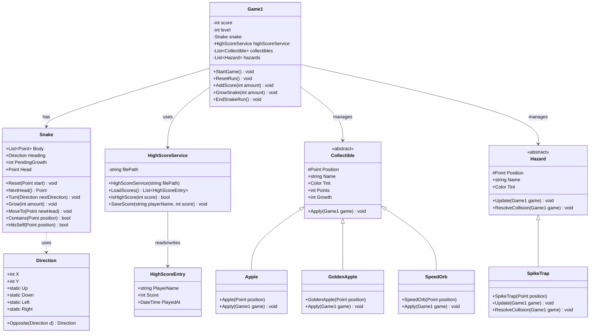

```mermaid
classDiagram
    class Game1 {
            -int score
            -int level
            -Snake snake
            -HighScoreService highScoreService
            -List~Collectible~ collectibles
            -List~Hazard~ hazards
            +StartGame() void
            +ResetRun() void
            +AddScore(int amount) void
            +GrowSnake(int amount) void
            +EndSnakeRun() void
        }

        class Snake {
            +List~Point~ Body
            +Direction Heading
            +int PendingGrowth
            +Point Head
            +Reset(Point start) void
            +NextHead() Point
            +Turn(Direction nextDirection) void
            +Grow(int amount) void
            +MoveTo(Point newHead) void
            +Contains(Point position) bool
            +HitsSelf(Point position) bool
        }

        class Collectible {
            <<abstract>>
            #Point Position
            +string Name
            +Color Tint
            +int Points
            +int Growth
            +Apply(Game1 game) void
        }

        class Apple {
            +Apple(Point position)
            +Apply(Game1 game) void
        }

        class GoldenApple {
            +GoldenApple(Point position)
            +Apply(Game1 game) void
        }

        class SpeedOrb {
            +SpeedOrb(Point position)
            +Apply(Game1 game) void
        }

        class Hazard {
            <<abstract>>
            #Point Position
            +string Name
            +Color Tint
            +Update(Game1 game) void
            +ResolveCollision(Game1 game) void
        }

        class SpikeTrap {
            +SpikeTrap(Point position)
            +Update(Game1 game) void
            +ResolveCollision(Game1 game) void
        }

        class Direction {
            +int X
            +int Y
            +static Up
            +static Down
            +static Left
            +static Right
            +Opposite(Direction d) Direction
        }

        class HighScoreEntry {
            +string PlayerName
            +int Score
            +DateTime PlayedAt
        }

        class HighScoreService {
            -string filePath
            +HighScoreService(string filePath)
            +LoadScores() List~HighScoreEntry~
            +IsHighScore(int score) bool
            +SaveScore(string playerName, int score) void
        }

        %% Relationships
        Game1 --> Snake : has
        Game1 --> HighScoreService : uses
        Game1 --> Collectible : manages
        Game1 --> Hazard : manages

        Collectible <|-- Apple
        Collectible <|-- GoldenApple
        Collectible <|-- SpeedOrb

        Hazard <|-- SpikeTrap

        HighScoreService --> HighScoreEntry : reads/writes
        Snake ..> Direction : uses
```
