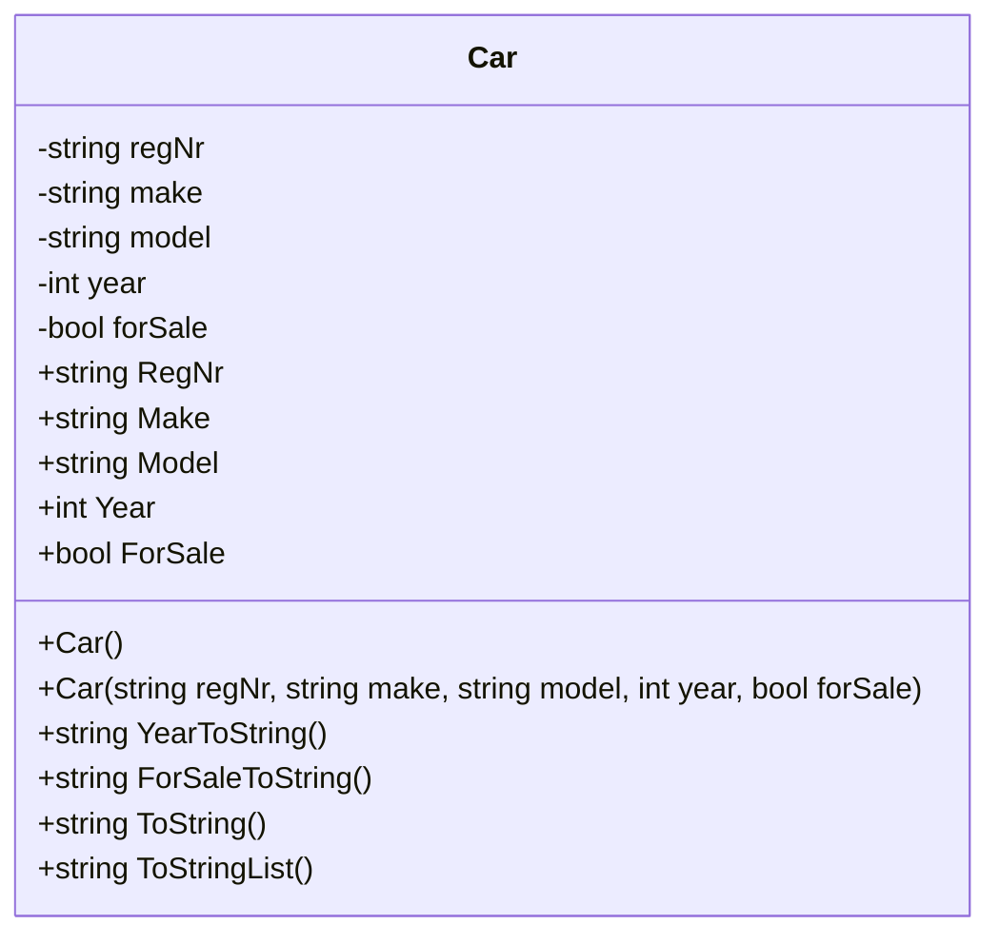

# UML Diagram: Car Class

## Mermaid Diagram

## Förklaring

### Medlemsvariabler (privata)

- `-` betyder private
- `regNr`, `make`, `model`, `year`, `forSale`

### Konstruktorer

- `+ Car()` - Defaultkonstruktor
- `+ Car(...)` - Konstruktor med parametrar

### Properties

- `+` betyder public
- `{get set}` visar att det är properties

### Metoder

- `+ YearToString()` - Returnerar string
- `+ ForSaleToString()` - Returnerar string
- `+ ToString()` - Returnerar string
- `+ ToStringList()` - Returnerar string (NY - för listutskrift)

## Program.cs Funktionalitet

### Samling

- `List<Car> carList` - Lagrar alla bilar i systemet

### Metoder

- `Menu()` - Visar meny och returnerar val
- `AddCar()` - Lägg till ny bil i listan
- `PrintList()` - Lista alla bilar
- `RemoveCar()` - Ta bort en bil från listan
- `EmptyList()` - Töm hela listan
- `AddCarsAtStart()` - Lägg till testbilar vid start
