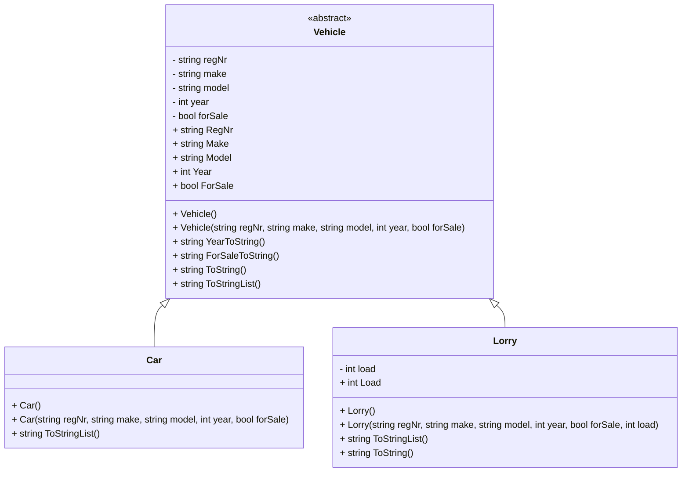

# UML Diagram - Vehicle Arv + Samling (m03u02)

## Mermaid Diagram

## Program.cs Funktionalitet

### Samling

- `List<Vehicle> vehicleList` - Lagra både bilar och lastbilar (polymorfism)

### Metoder

- `Menu()` - Visar meny och returnerar val
- `AddVehicle()` - Lägg till bil eller lastbil
- `PrintList()` - Lista alla fordon
- `RemoveVehicle()` - Ta bort ett fordon från listan
- `EmptyList()` - Töm hela listan
- `AddVehiclesAtStart()` - Lägg till testfordon vid start

