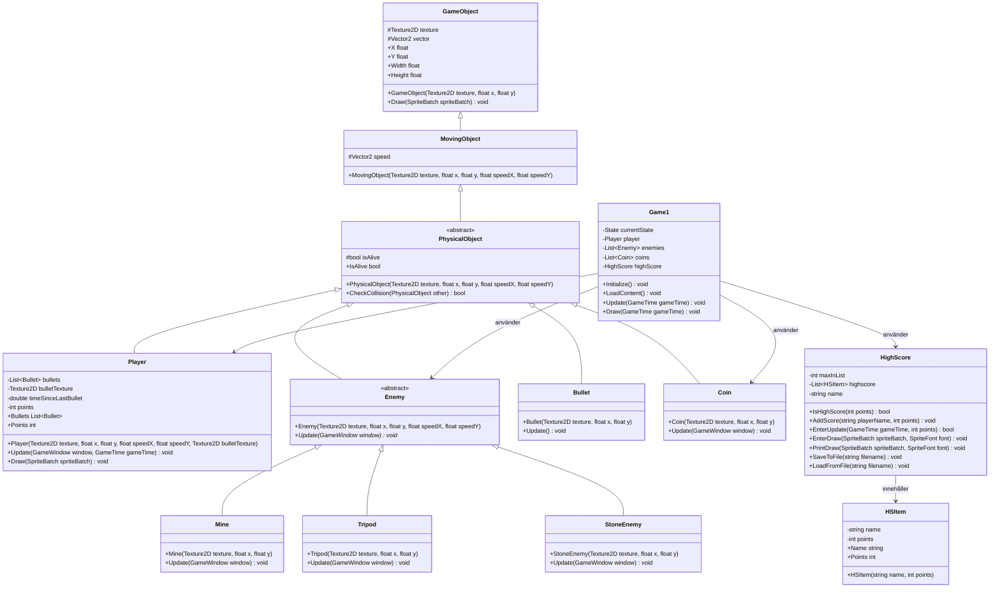

# UML

```mermaid
classDiagram
    class GameObject {
      #Texture2D texture
      #Vector2 vector
      +GameObject(Texture2D texture, float x, float y)
      +Draw(SpriteBatch spriteBatch) void
      +X float
      +Y float
      +Width float
      +Height float
    }

    class MovingObject {
      #Vector2 speed
      +MovingObject(Texture2D texture, float x, float y, float speedX, float speedY)
    }

    class PhysicalObject {
      <<abstract>>
      #bool isAlive
      +PhysicalObject(Texture2D texture, float x, float y, float speedX, float speedY)
      +CheckCollision(PhysicalObject other) bool
      +IsAlive bool
    }

    class Player {
      -List~Bullet~ bullets
      -Texture2D bulletTexture
      -double timeSinceLastBullet
      -int points
      +Player(Texture2D texture, float x, float y, float speedX, float speedY, Texture2D bulletTexture)
      +Update(GameWindow window, GameTime gameTime) void
      +Draw(SpriteBatch spriteBatch) void
      +Bullets List~Bullet~
      +Points int
    }

    class Enemy {
      <<abstract>>
      +Enemy(Texture2D texture, float x, float y, float speedX, float speedY)
      +Update(GameWindow window) void*
    }

    class Mine {
      +Mine(Texture2D texture, float x, float y)
      +Update(GameWindow window) void
    }

    class Tripod {
      +Tripod(Texture2D texture, float x, float y)
      +Update(GameWindow window) void
    }

    class StoneEnemy {
      +StoneEnemy(Texture2D texture, float x, float y)
      +Update(GameWindow window) void
    }

    class Bullet {
      +Bullet(Texture2D texture, float x, float y)
      +Update() void
    }

    class Coin {
      +Coin(Texture2D texture, float x, float y)
      +Update(GameWindow window) void
    }

    class HighScore {
      -int maxInList
      -List~HSItem~ highscore
      -string name
      +IsHighScore(int points) bool
      +AddScore(string playerName, int points) void
      +EnterUpdate(GameTime gameTime, int points) bool
      +EnterDraw(SpriteBatch spriteBatch, SpriteFont font) void
      +PrintDraw(SpriteBatch spriteBatch, SpriteFont font) void
      +SaveToFile(string filename) void
      +LoadFromFile(string filename) void
    }

    class HSItem {
      -string name
      -int points
      +Name string
      +Points int
      +HSItem(string name, int points)
    }

    GameObject <|-- MovingObject
    MovingObject <|-- PhysicalObject
    PhysicalObject <|-- Player
    PhysicalObject <|-- Enemy
    PhysicalObject <|-- Bullet
    PhysicalObject <|-- Coin
    Enemy <|-- Mine
    Enemy <|-- Tripod
    Enemy <|-- StoneEnemy

    HighScore --> HSItem : innehåller

    class Game1 {
      -State currentState
      -Player player
      -List~Enemy~ enemies
      -List~Coin~ coins
      -HighScore highScore
      +Initialize() void
      +LoadContent() void
      +Update(GameTime gameTime) void
      +Draw(GameTime gameTime) void
    }

    Game1 --> Player
    Game1 --> Enemy : använder
    Game1 --> Coin : använder
    Game1 --> HighScore : använder
```
